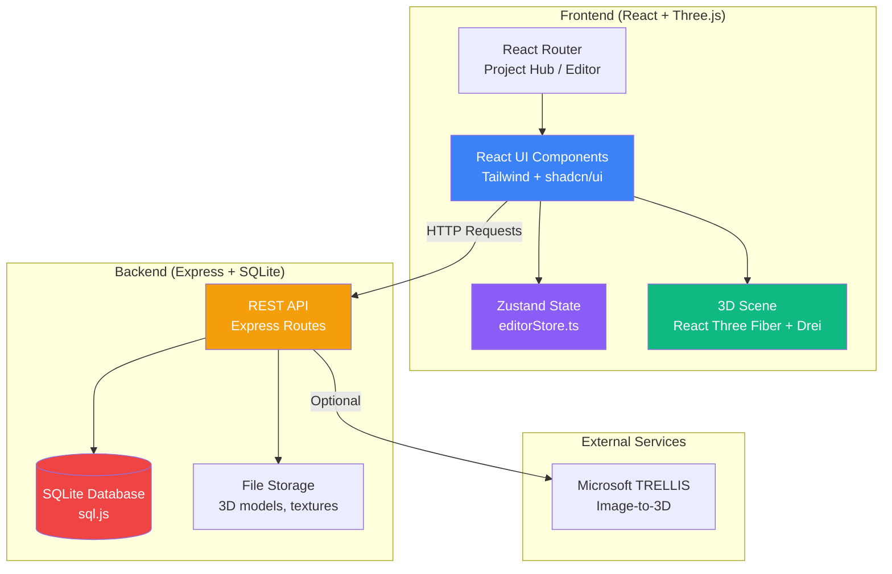

# AI Master Context File

**🚀 START HERE** — This document is the primary entry-point for AI coding agents working on Home Designer.

## Table of Contents
- [Project Identity](#project-identity)
- [Technology Stack](#technology-stack)
- [High-Level Architecture](#high-level-architecture)
- [Key File Paths](#key-file-paths)
- [Critical Patterns](#critical-patterns)
- [Documentation Index](#documentation-index)
- [Before You Code - Checklist](#before-you-code---checklist)

---

## Project Identity

**Name:** Home Designer
**Purpose:** Open-source, self-hosted 3D interior design application for visualizing apartment and house interiors
**Architecture:** Single-user, local-first desktop web application (no authentication required)
**Inspiration:** The Sims (ease of use) + Blender/Figma (professional polish) + 21st.dev (design quality)

**Core Philosophy:**
- **Local-first**: All data stored in SQLite, no cloud dependencies
- **Self-hosted**: Runs entirely on user's machine
- **Zero-config**: No database setup, no authentication, works out of the box
- **AI-powered**: Image-to-3D via Microsoft TRELLIS, photo-to-room reconstruction
- **Professional UX**: Dark editor theme, glassmorphism, purposeful animations

---

## Technology Stack

### Frontend (`frontend/`)
| Technology | Version | Purpose |
|------------|---------|---------|
| **React** | `^18.2.0` | UI framework |
| **TypeScript** | `^5.2.2` | Type safety and developer experience |
| **Three.js** | `^0.160.0` | Core 3D rendering engine |
| **React Three Fiber** | `^8.15.0` | React bindings for Three.js |
| **@react-three/drei** | `^9.92.0` | Three.js helpers (OrbitControls, gizmos, etc.) |
| **Zustand** | `^4.4.7` | State management (editor state, undo/redo) |
| **Tailwind CSS** | `^3.4.0` | Utility-first styling |
| **shadcn/ui** | N/A | Component library (installed as source files) |
| **Framer Motion** | `^10.16.16` | Animations and transitions |
| **Lucide React** | `^0.300.0` | Icon library |
| **React Router DOM** | `^6.21.0` | Client-side routing |
| **Sonner** | `^2.0.7` | Toast notifications |
| **Vite** | `^5.0.8` | Build tool and dev server |

### Backend (`backend/`)
| Technology | Version | Purpose |
|------------|---------|---------|
| **Node.js** | `20+` | Runtime (required version) |
| **Express** | `^4.18.2` | REST API server |
| **sql.js** | `^1.10.3` | SQLite in-memory with file persistence |
| **CORS** | `^2.8.5` | Cross-origin requests |
| **Multer** | `^1.4.5-lts.1` | File upload handling |
| **Dotenv** | `^16.3.1` | Environment configuration |
| **Archiver** | `^7.0.1` | ZIP export for project backups |
| **PDFKit** | `^0.17.2` | Floor plan PDF generation |
| **Puppeteer** | `^21.7.0` | Screenshot rendering |
| **Cheerio** | `^1.0.0-rc.12` | HTML parsing for web scraping |
| **Unzipper** | `^0.12.3` | Project import |

### Root Level
| Technology | Version | Purpose |
|------------|---------|---------|
| **better-sqlite3** | `^12.6.2` | Native SQLite bindings (for feature management) |
| **Playwright** | `^1.58.2` | End-to-end browser testing |

### AI Services (Optional)
| Service | Purpose |
|---------|---------|
| **Microsoft TRELLIS** | Image-to-3D model generation (requires API key or local inference) |

---

## High-Level Architecture



### Request Flow
1. **User Interaction** → React component event handler
2. **State Update** → Zustand store mutation (editorStore)
3. **API Call** → `fetch()` via `frontend/src/lib/api.ts`
4. **Backend Processing** → Express route handler
5. **Database Query** → sql.js executes SQL
6. **Database Persistence** → Auto-save to `backend/database.db` file
7. **Response** → JSON back to frontend
8. **UI Update** → React re-renders, Three.js scene updates

---

## Key File Paths

### Configuration Files (Root)
| Path | Purpose |
|------|---------|
| `package.json` | Root workspace, shared dependencies |
| `init.sh` | Development setup script (installs deps, starts servers) |
| `install-and-run.bat` | Windows setup script |
| `.gitignore` | Git exclusions (includes test artifacts, screenshots, logs) |
| `.env.example` | Environment variable template |
| `LICENSE` | MIT license |

### Frontend Structure (`frontend/`)
| Path | Purpose |
|------|---------|
| `src/App.tsx` | Root component with React Router |
| `src/main.tsx` | Entry point, renders App |
| `src/index.css` | Global styles, Tailwind imports |
| `src/store/editorStore.ts` | **Zustand store** — editor state, undo/redo, selections |
| `src/lib/api.ts` | **API client** — fetch wrappers for all backend endpoints |
| `src/lib/units.ts` | Unit conversion (meters ↔ feet) |
| `src/components/ProjectHub.tsx` | **Landing page** — project list, create/delete |
| `src/components/Editor.tsx` | **Main editor** — toolbar, panels, viewport orchestration |
| `src/components/Viewport3D.tsx` | **3D scene** — React Three Fiber canvas, camera, lights |
| `src/components/AssetLibrary.tsx` | Furniture library sidebar |
| `src/components/PropertiesPanel.tsx` | Right sidebar — object properties, room details |
| `src/components/FloorSwitcher.tsx` | Floor navigation UI |
| `src/components/SettingsModal.tsx` | App settings (units, performance, AI keys) |
| `src/components/ExportModal.tsx` | Export dialog (screenshots, 3D, floor plans) |
| `src/components/AIGenerationModal.tsx` | AI image-to-3D generation UI |
| `src/components/URLImportModal.tsx` | Import furniture from product URLs |
| `src/components/WallMesh.tsx` | Custom Three.js component for rendering walls |
| `vite.config.ts` | Vite build configuration |
| `tailwind.config.js` | Tailwind CSS configuration |
| `tsconfig.json` | TypeScript configuration |

### Backend Structure (`backend/`)
| Path | Purpose |
|------|---------|
| `src/server.js` | **Express app** — entry point, middleware, routes |
| `src/db/connection.js` | **Database connection** — sql.js instance, auto-save logic |
| `src/db/init.js` | **Schema setup** — table creation, initial data seeding |
| `src/db/migrations/` | Schema migrations (future-proofing) |
| `src/routes/projects.js` | `/api/projects` — CRUD for projects |
| `src/routes/floors.js` | `/api/projects/:id/floors`, `/api/floors/:id` |
| `src/routes/rooms.js` | `/api/floors/:id/rooms`, `/api/rooms/:id` |
| `src/routes/walls.js` | `/api/rooms/:id/walls`, `/api/walls/:id` |
| `src/routes/furniture.js` | `/api/rooms/:id/furniture`, `/api/furniture/:id` |
| `src/routes/assets.js` | `/api/assets` — furniture library management |
| `src/routes/settings.js` | `/api/settings` — user settings CRUD |
| `src/routes/ai.js` | `/api/ai/*` — TRELLIS integration, AI generation |
| `src/routes/export.js` | `/api/export/*` — screenshots, 3D exports, PDFs |
| `database.db` | SQLite database file (auto-created, gitignored) |

### Static Assets (`assets/`)
| Path | Purpose |
|------|---------|
| `assets/models/` | 3D models (glTF/GLB) for built-in furniture |
| `assets/textures/` | Material textures (wood, tile, carpet, etc.) |
| `assets/thumbnails/` | Preview images for asset library |

### Documentation (`docs/`)
| Path | Purpose |
|------|---------|
| `docs/AI_CONTEXT.md` | **This file** — AI agent starting point |
| `docs/VISION.md` | Design philosophy, project goals, future direction |
| `docs/FILE_MAP.md` | Annotated directory tree |

### Other Important Files
| Path | Purpose |
|------|---------|
| `README.md` | User-facing documentation, setup instructions |
| `CONTRIBUTING.md` | Contributor guidelines, coding standards |
| `.autoforge/` | AI orchestration configuration (feature management) |
| `.playwright-cli/` | Browser automation test artifacts |

---

## Critical Patterns

### 1. State Management (Zustand)
**File:** `frontend/src/store/editorStore.ts`

```typescript
// Zustand store pattern
export const useEditorStore = create<EditorState>((set, get) => ({
  // State
  activeTool: 'select',
  selectedObjects: [],

  // Actions
  setActiveTool: (tool) => set({ activeTool: tool }),
  selectObject: (id) => set(state => ({
    selectedObjects: [...state.selectedObjects, id]
  }))
}));

// Usage in components
import { useEditorStore } from '../store/editorStore';

function Component() {
  const activeTool = useEditorStore(state => state.activeTool);
  const setActiveTool = useEditorStore(state => state.setActiveTool);
}
```

**Key Stores:**
- `editorStore.ts` — Editor state, tool selection, undo/redo, selections

### 2. API Communication
**File:** `frontend/src/lib/api.ts`

All API calls use fetch wrappers from `api.ts`:

```typescript
import { getProjects, createProject, deleteProject } from './lib/api';

// Example: Fetch all projects
const projects = await getProjects();

// Example: Create a new project
const newProject = await createProject({
  name: 'My Home',
  description: 'Living room redesign'
});
```

**API Base URL:** `http://localhost:5000/api`

### 3. 3D Rendering (React Three Fiber)
**File:** `frontend/src/components/Viewport3D.tsx`

```typescript
import { Canvas } from '@react-three/fiber';
import { OrbitControls, Grid } from '@react-three/drei';

function Viewport3D() {
  return (
    <Canvas camera={{ position: [10, 10, 10] }}>
      <ambientLight intensity={0.5} />
      <OrbitControls />
      {/* 3D objects here */}
    </Canvas>
  );
}
```

**Custom 3D Components:**
- `WallMesh.tsx` — Renders walls with cutouts for windows/doors
- `FurnitureMesh` (inline in Viewport3D) — Renders furniture placements

### 4. Error Handling

**Frontend:**
```typescript
import { toast } from 'sonner';

try {
  await createProject(data);
  toast.success('Project created!');
} catch (error) {
  toast.error('Failed to create project');
  console.error(error);
}
```

**Backend:**
```javascript
app.use((err, req, res, next) => {
  console.error('Error:', err);
  res.status(err.status || 500).json({
    error: {
      message: err.message || 'Internal server error',
      status: err.status || 500,
    },
  });
});
```

### 5. Database Patterns

**Connection:** `backend/src/db/connection.js` manages a single sql.js instance
- In-memory database loaded from `database.db` file on startup
- Auto-saves to file every 5 seconds and after every write operation
- Manual save via `saveDatabase()` function

**Query Pattern:**
```javascript
import { getDatabase } from './db/connection.js';

const db = await getDatabase();
const result = db.exec(`
  SELECT * FROM projects WHERE id = ?
`, [projectId]);

// Process results
const values = result[0]?.values || [];
```

### 6. Routing (React Router)
**File:** `frontend/src/App.tsx`

```typescript
<Routes>
  <Route path="/" element={<ProjectHub />} />
  <Route path="/editor/:projectId" element={<Editor />} />
  <Route path="*" element={<NotFound />} />
</Routes>
```

**Navigation:**
```typescript
import { useNavigate, useParams } from 'react-router-dom';

const navigate = useNavigate();
const { projectId } = useParams();

// Navigate to editor
navigate(`/editor/${projectId}`);
```

---

## Documentation Index

| Document | Description |
|----------|-------------|
| [`AI_CONTEXT.md`](./AI_CONTEXT.md) | **This file** — Quick reference for AI agents |
| [`VISION.md`](./VISION.md) | Project vision, design philosophy, why decisions were made |
| [`FILE_MAP.md`](./FILE_MAP.md) | Annotated directory tree of entire codebase |
| [`../README.md`](../README.md) | User-facing setup guide, feature overview |
| [`../CONTRIBUTING.md`](../CONTRIBUTING.md) | Contribution guidelines, PR checklist, coding standards |
| [`../LICENSE`](../LICENSE) | MIT license text |

---

## Before You Code - Checklist

### ✅ Understanding Requirements
- [ ] Read the feature description or issue thoroughly
- [ ] Identify which components/files need changes
- [ ] Check if similar functionality exists elsewhere (for consistency)
- [ ] Understand the user flow (Project Hub → Editor → 3D Viewport)

### ✅ Architecture Decisions
- [ ] **State goes in Zustand** — Avoid React useState for shared editor state
- [ ] **API calls via `api.ts`** — Don't use raw fetch in components
- [ ] **Database changes require migration** — Update `init.js` schema
- [ ] **3D logic in R3F components** — Keep Three.js code in Viewport3D or custom meshes

### ✅ Code Conventions
- [ ] **TypeScript for frontend** — Always add types, avoid `any`
- [ ] **Tailwind for styling** — Use utility classes, avoid inline styles
- [ ] **shadcn/ui for UI components** — Don't reinvent buttons, dialogs, etc.
- [ ] **Lucide icons** — Import from `lucide-react`
- [ ] **Toast notifications** — Use `toast` from `sonner` for user feedback

### ✅ Testing & Verification
- [ ] Test in browser at `http://localhost:5173`
- [ ] Check browser console for errors (must be zero)
- [ ] Verify API responses in Network tab
- [ ] Test undo/redo if modifying editor state
- [ ] Test across different screen sizes (responsive)

### ✅ What NOT to Modify
- [ ] **Do NOT change database file directly** — Use API or schema migrations
- [ ] **Do NOT commit test artifacts** — `.gitignore` handles this
- [ ] **Do NOT skip type safety** — Fix TypeScript errors, don't use `@ts-ignore`
- [ ] **Do NOT use inline styles** — Use Tailwind classes or CSS modules

### ✅ Git Commit Guidelines
- [ ] Descriptive commit message (e.g., "feat: add furniture rotation gizmo")
- [ ] Stage only relevant files (no accidental test files)
- [ ] Run `npm run lint` in frontend before committing
- [ ] Verify build succeeds: `npm run build` in frontend

### ✅ Feature Implementation Workflow
1. **Claim feature** — Mark as in-progress via feature management system
2. **Read requirements** — Understand all verification steps
3. **Plan changes** — Identify files to modify
4. **Implement** — Write code following patterns above
5. **Test manually** — Use browser automation (playwright-cli)
6. **Verify checklist** — Security, real data, no mocks, persistence
7. **Mark passing** — Update feature status
8. **Git commit** — Descriptive message with feature reference
9. **Update progress** — Document in `claude-progress.txt`

---

## Quick Command Reference

```bash
# Start development environment
./init.sh                    # macOS/Linux/Git Bash
install-and-run.bat          # Windows

# Frontend (in frontend/ directory)
npm run dev                  # Start dev server (localhost:5173)
npm run build                # Production build
npm run lint                 # Run ESLint

# Backend (in backend/ directory)
npm run dev                  # Start API server (localhost:5000)
npm run db:init              # Initialize/reset database

# Testing
playwright-cli open http://localhost:5173  # Open browser
playwright-cli snapshot                     # Capture page structure
playwright-cli screenshot                   # Take visual snapshot
playwright-cli console                      # Check for JS errors
playwright-cli close                        # Close browser

# Git workflow
git status                                  # Check changes
git add .                                   # Stage all changes
git commit -m "feat: description"           # Commit
git log --oneline -10                       # View recent commits
```

---

## Database Schema Quick Reference

### Core Tables
- `projects` — Top-level projects
- `floors` — Floors within projects
- `rooms` — Rooms on floors (with dimensions, materials)
- `walls` — Wall segments in rooms
- `windows` — Window openings in walls
- `doors` — Door openings in walls
- `furniture_placements` — Furniture instances in rooms
- `assets` — Furniture library (reusable objects)
- `asset_tags` — Tags for asset categorization
- `lights` — Light fixtures in rooms
- `edit_history` — Undo/redo stack
- `ai_generations` — AI generation history
- `user_settings` — App preferences
- `material_presets` — Material library

---

## AI-Specific Notes

### Context Window Management
- This file is designed to be read once at session start
- Refer to specific sections as needed during implementation
- Use `docs/FILE_MAP.md` to locate specific files
- Use `docs/VISION.md` to understand design intent

### Feature-Driven Development
- Features are tracked in `features.db` SQLite database
- Each feature has verification steps that must pass
- Use feature management tools to claim, implement, and mark passing
- Test thoroughly via browser automation (playwright-cli)
- Mark passing only after complete verification

### Common Pitfalls
- **Don't use in-memory mock data** — All data must persist to SQLite
- **Don't skip console error checks** — Zero errors is mandatory
- **Don't assume files exist** — Verify paths before referencing
- **Don't bypass UI testing** — Use actual browser clicks, not eval()

---

**Last Updated:** 2026-02-27
**Project Version:** 0.1.0
**Status:** 137/152 features complete (90.1%)

**Need Help?** Check `docs/VISION.md` for design decisions, `docs/FILE_MAP.md` for file locations, or `CONTRIBUTING.md` for coding standards.
