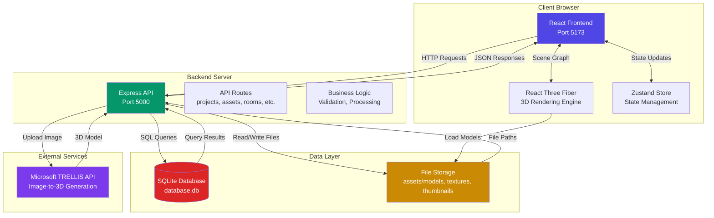
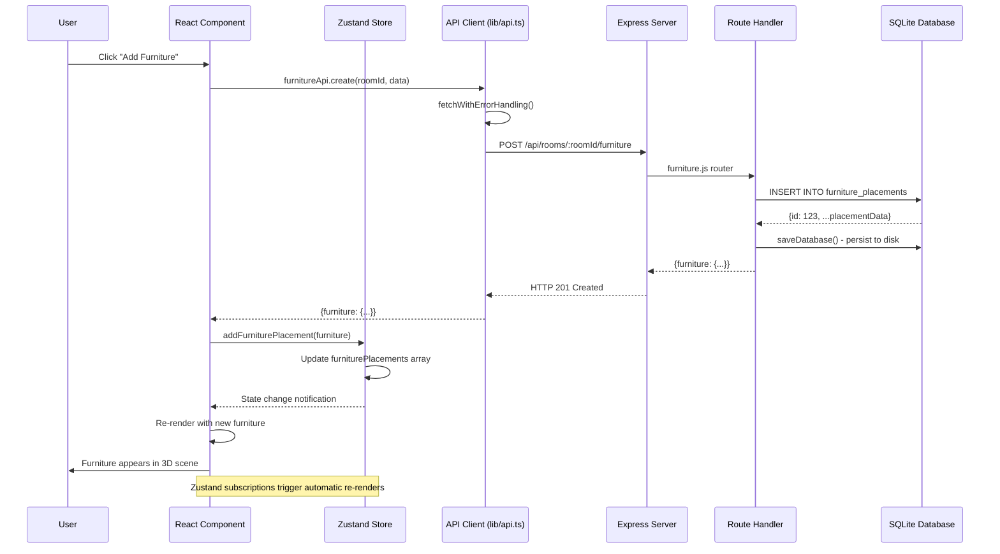
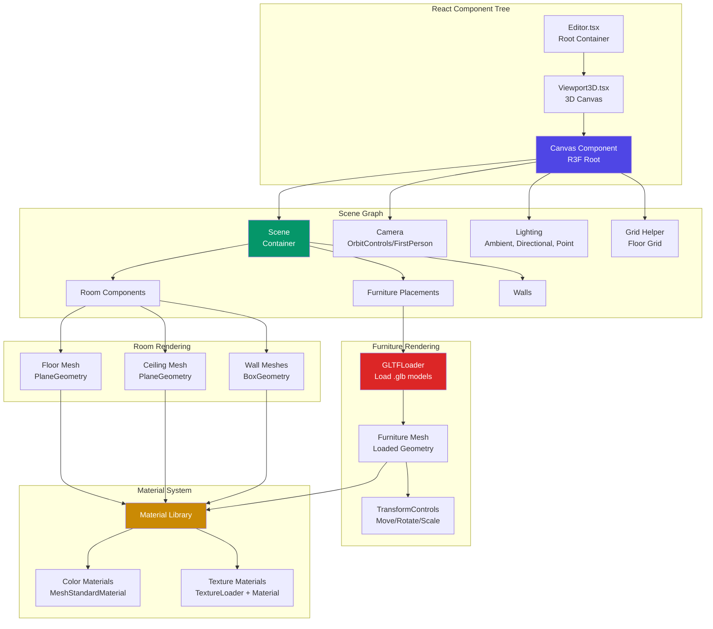
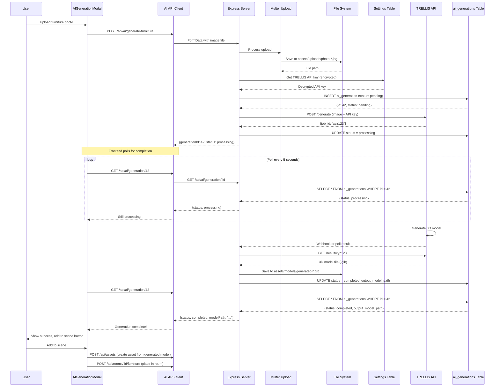
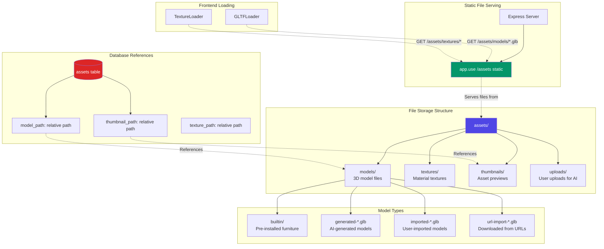
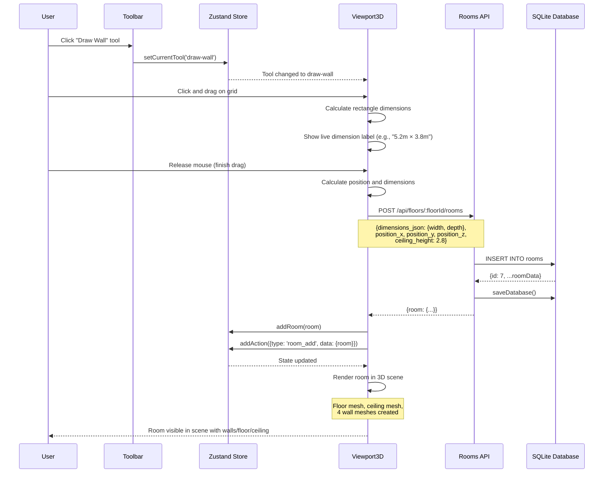
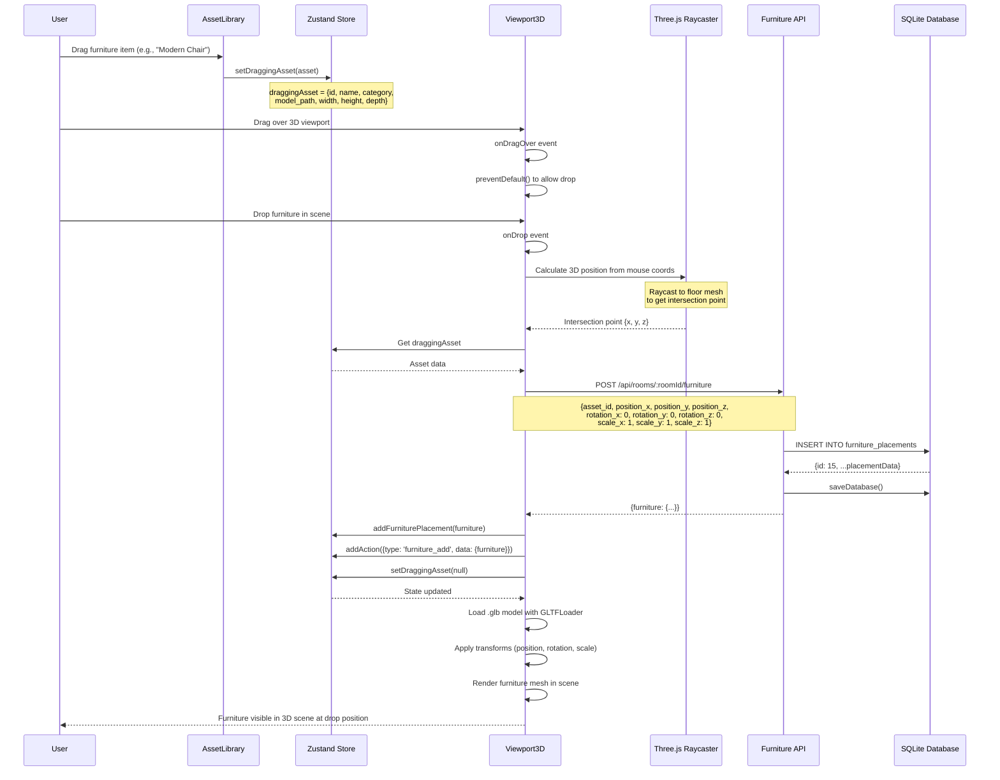
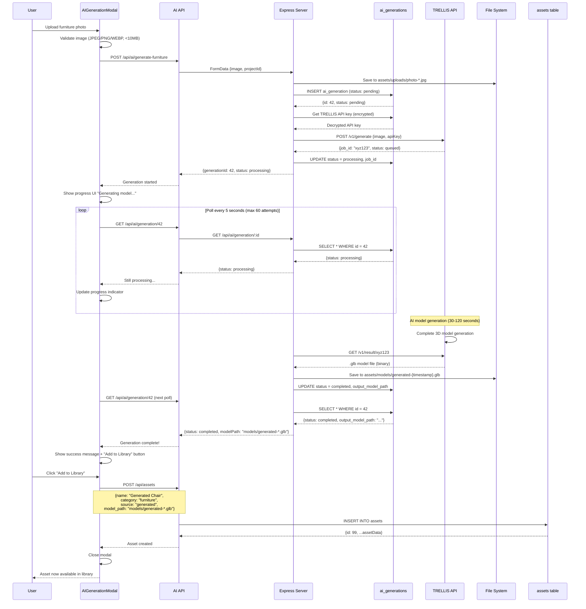
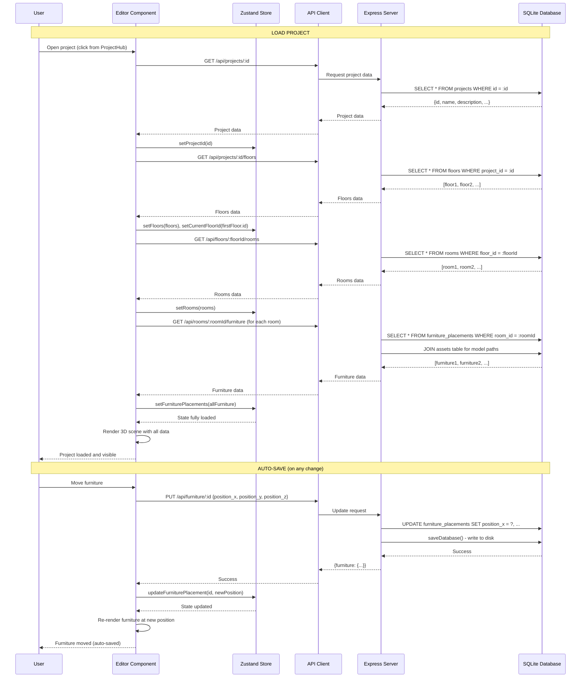

# System Architecture & Data Flow

This document describes the architecture of Home Designer, a self-hosted 3D interior design application. It explains how the major components interact, how data flows through the system, and the design decisions behind the architecture.

## Table of Contents

- [System Overview](#system-overview)
- [Request Lifecycle](#request-lifecycle)
- [3D Rendering Pipeline](#3d-rendering-pipeline)
- [AI Generation Pipeline](#ai-generation-pipeline)
- [State Management Architecture](#state-management-architecture)
- [Data Persistence](#data-persistence)
- [File Storage Architecture](#file-storage-architecture)
- [Key User Journeys](#key-user-journeys)
  - [Room Creation Flow](#room-creation-flow)
  - [Furniture Placement Flow](#furniture-placement-flow)
  - [AI Model Generation Flow](#ai-model-generation-flow)
  - [Project Save/Load Flow](#project-saveload-flow)
- [Design Decisions](#design-decisions)

---

## System Overview

Home Designer follows a client-server architecture with a clear separation of concerns between the frontend (presentation & 3D rendering), backend (API & business logic), database (persistence), and file storage.



### Component Responsibilities

- **React Frontend**: User interface, 3D visualization, user interactions, client-side state
- **React Three Fiber**: 3D scene graph management, camera controls, lighting, model rendering
- **Zustand Store**: Global state for editor (tools, selections, floors, rooms, furniture, undo/redo)
- **Express API**: RESTful endpoints, request validation, database access, file management
- **SQLite Database**: Persistent storage for projects, rooms, furniture placements, settings
- **File Storage**: Physical storage for 3D models (glTF/GLB), textures, thumbnails, uploads
- **TRELLIS API**: AI-powered image-to-3D model generation

---

## Request Lifecycle

This diagram shows the complete lifecycle of a typical user action, from clicking a button in the UI through state updates, API calls, database queries, and back to the UI.



### Error Handling

The API client (`frontend/src/lib/api.ts`) includes comprehensive error handling:

- **Network Errors**: Detects when backend is unreachable (connection refused, DNS failures)
- **Timeout Errors**: 30-second timeout for all requests with automatic AbortController cleanup
- **HTTP Errors**: User-friendly messages for 404, 500, 503 status codes
- **Validation Errors**: Server-side validation with detailed error messages

Example error flow:
```
User Action → API Call → Network Failure → ApiError thrown →
Toast notification with user-friendly message
```

---

## 3D Rendering Pipeline

Home Designer uses **React Three Fiber** (R3F), a React renderer for Three.js. This provides declarative, component-based 3D scene management with automatic updates when state changes.



### Rendering Process

1. **Component Mount**: `Viewport3D.tsx` renders R3F `<Canvas>` component
2. **Scene Setup**: Camera, lights, and grid are added to scene
3. **Data Loading**: Rooms and furniture placements loaded from Zustand store
4. **Mesh Creation**:
   - Rooms create floor, ceiling, and wall meshes with `BoxGeometry` and `PlaneGeometry`
   - Furniture components use `GLTFLoader` to load `.glb` model files asynchronously
5. **Material Application**: Materials (colors or textures) applied via `MeshStandardMaterial`
6. **Transform Controls**: When furniture is selected, `TransformControls` gizmo appears for manipulation
7. **Reactive Updates**: When store state changes (e.g., furniture moves), components automatically re-render

### Performance Optimizations

- **Level of Detail (LOD)**: Planned feature for complex models (not yet implemented)
- **Draco Compression**: Model compression for faster loading (referenced in README)
- **Lazy Loading**: Furniture models loaded on-demand, not all at once
- **Instance Reuse**: Multiple instances of same furniture share the same loaded geometry

### Camera Modes

- **Isometric/Orbit**: Default mode using R3F `OrbitControls` for rotating around scene
- **First-Person**: Planned feature for walking through rooms (referenced in README)
- **Per-Floor Memory**: Camera position stored per floor in Zustand store (`cameraPositions` map)

---

## AI Generation Pipeline

Home Designer integrates with **Microsoft TRELLIS** for AI-powered image-to-3D model generation. Users can upload a photo of furniture or a room, and the system generates a 3D model.



### AI Generation States

The `ai_generations` table tracks generation status:

- **`pending`**: Job created, waiting to send to TRELLIS
- **`processing`**: Sent to TRELLIS API, awaiting completion
- **`completed`**: Model generated successfully, saved to file system
- **`failed`**: Generation failed (timeout, API error, invalid image, etc.)

### API Key Security

- API keys stored in `user_settings` table with `encrypted = 1` flag
- Encrypted using AES-256-CBC with IV (Initialization Vector)
- Encryption key from `process.env.ENCRYPTION_KEY` or default fallback
- Decryption happens server-side only, never sent to frontend
- Keys configurable via Settings modal in UI

### File Management

- **Input Images**: Stored in `assets/uploads/photo-{timestamp}-{random}.{ext}`
- **Output Models**: Stored in `assets/models/generated-{timestamp}.glb`
- **Thumbnails**: Auto-generated via screenshot or placeholder (planned feature)
- **Cleanup**: Old failed generations can be cleaned up periodically

---

## State Management Architecture

Home Designer uses **Zustand** for state management. Zustand is a lightweight alternative to Redux, providing a simple hook-based API with minimal boilerplate.

```mermaid
graph TB
    subgraph "Zustand Store (editorStore.ts)"
        Store[Editor Store]

        subgraph "Editor State"
            Tool[currentTool: EditorTool]
            Grid[gridVisible: boolean]
            Light[lightingMode: day/night]
        end

        subgraph "Project & Floors"
            Project[projectId: number]
            Floors[floors: Floor array]
            CurrentFloor[currentFloorId: number]
            CameraPos[cameraPositions: Record]
        end

        subgraph "Scene Objects"
            Rooms[rooms: Room array]
            Furniture[furniturePlacements: array]
            Drag[draggingAsset: Asset]
        end

        subgraph "Selections"
            SelRoom[selectedRoomId: number]
            SelFurniture[selectedFurnitureId: number]
            SelWall[selectedWallId: number]
            SelMulti[selectedFurnitureIds: array]
        end

        subgraph "History (Undo/Redo)"
            History[history: HistoryAction array]
            Index[historyIndex: number]
            Actions[Action types:<br/>furniture_add, furniture_remove,<br/>furniture_move, room_add]
        end

        Store --> Tool
        Store --> Grid
        Store --> Light
        Store --> Project
        Store --> Floors
        Store --> CurrentFloor
        Store --> CameraPos
        Store --> Rooms
        Store --> Furniture
        Store --> Drag
        Store --> SelRoom
        Store --> SelFurniture
        Store --> SelWall
        Store --> SelMulti
        Store --> History
        Store --> Index
        Store --> Actions
    end

    subgraph "React Components"
        Editor[Editor.tsx]
        Viewport[Viewport3D.tsx]
        Props[PropertiesPanel.tsx]
        Library[AssetLibrary.tsx]
        FloorSwitch[FloorSwitcher.tsx]
        HistoryUI[EditHistory.tsx]
    end

    Editor -->|useEditorStore| Store
    Viewport -->|useEditorStore| Store
    Props -->|useEditorStore| Store
    Library -->|useEditorStore| Store
    FloorSwitch -->|useEditorStore| Store
    HistoryUI -->|useEditorStore| Store

    Store -.->|Subscription| Editor
    Store -.->|Subscription| Viewport
    Store -.->|Subscription| Props

    style Store fill:#4f46e5,color:#fff
    style History fill:#dc2626,color:#fff
```



### Store Organization

The single Zustand store (`editorStore.ts`) is organized into logical sections:

1. **Editor State**: Current tool, grid visibility, lighting mode, unit system
2. **Project & Floors**: Project ID, list of floors, current floor, per-floor camera positions
3. **Scene Objects**: Rooms, furniture placements, currently dragging asset
4. **Selections**: Selected room/furniture/wall, multi-select furniture IDs
5. **History**: Undo/redo stack with action history and current index

### Subscription Pattern

Components subscribe to store changes using the `useEditorStore` hook:

```typescript
// Component automatically re-renders when currentTool changes
const currentTool = useEditorStore((state) => state.currentTool);
```

Zustand uses **selector-based subscriptions**: components only re-render when the specific slice of state they access changes, preventing unnecessary updates.

### Undo/Redo Implementation

The undo/redo system is implemented directly in the store:

- **Action Recording**: When user performs an action (add furniture, move object), an action is added to history
- **Stack Management**: Actions stored in array, `historyIndex` points to current position
- **Undo**: Reverses action at current index, moves index back, makes API call to revert database
- **Redo**: Re-applies action at next index, moves index forward, makes API call to reapply
- **New Actions**: When a new action is performed, all "future" actions (redo stack) are discarded
- **History Limit**: Limited to last 100 actions to prevent memory issues

Action types include:
- `furniture_add`: Records added furniture for undo (removal)
- `furniture_remove`: Records removed furniture for redo (re-addition)
- `furniture_move`: Records previous and new positions for both undo and redo
- `room_add`, `room_remove`: (Planned for future features)

### Why Zustand?

- **Simplicity**: No providers, no reducers, just `create()` and `useStore()`
- **Performance**: Selector-based subscriptions prevent unnecessary re-renders
- **Minimal Boilerplate**: Less code than Redux or Context API
- **TypeScript Support**: Full type safety with interfaces
- **DevTools**: Compatible with Redux DevTools for debugging
- **No Context Wrapping**: Works anywhere in component tree without provider setup

---

## Data Persistence

Home Designer uses **SQLite** via `sql.js` for data persistence. This provides a full SQL database that runs in-memory with periodic saves to disk.

```mermaid
graph TB
    subgraph "In-Memory Database"
        MemDB[(sql.js Database<br/>In-Memory)]
        CRUD[CRUD Operations<br/>Fast In-Memory Queries]
    end

    subgraph "Persistence Layer"
        SaveTrigger[Save Triggers]
        AutoSave[Auto-save on mutations]
        ManualSave[Manual save endpoint]
        Export[db.export to buffer]
    end

    subgraph "Disk Storage"
        DiskDB[(database.db<br/>SQLite File)]
    end

    subgraph "API Routes"
        Projects[/api/projects]
        Floors[/api/floors]
        Rooms[/api/rooms]
        Furniture[/api/furniture]
        Settings[/api/settings]
    end

    Projects --> CRUD
    Floors --> CRUD
    Rooms --> CRUD
    Furniture --> CRUD
    Settings --> CRUD

    CRUD --> MemDB

    CRUD --> SaveTrigger
    SaveTrigger --> AutoSave
    AutoSave --> Export
    ManualSave --> Export

    Export --> DiskDB

    DiskDB -.->|On server start| MemDB

    style MemDB fill:#4f46e5,color:#fff
    style DiskDB fill:#dc2626,color:#fff
    style AutoSave fill:#059669,color:#fff
```

### Database Tables

The database schema includes 14 tables (see `backend/src/db/init.js`):

**Core Tables:**
- `projects`: Project metadata, unit system, timestamps
- `floors`: Floor levels within projects
- `rooms`: Room geometry (dimensions_json), materials, positions
- `walls`: Wall geometry, materials, windows/doors flags

**Asset Tables:**
- `assets`: 3D model library (builtin, generated, imported, url_import)
- `asset_tags`: Tags for search/filtering
- `furniture_placements`: Placed furniture instances in rooms with transforms

**Additional Tables:**
- `lights`: Lighting fixtures in rooms
- `windows`, `doors`: Window and door placements on walls
- `edit_history`: Undo/redo action history (persisted)
- `ai_generations`: AI generation job tracking
- `user_settings`: App settings, encrypted API keys
- `material_presets`: Reusable material configurations

### Save Strategy

**Auto-Save on Mutations:**
- After every `INSERT`, `UPDATE`, `DELETE` operation, `saveDatabase()` is called
- `saveDatabase()` exports in-memory database to Buffer and writes to `backend/database.db`
- This ensures data is persisted immediately, preventing data loss on crashes

**Trade-offs:**
- **Pros**: Immediate persistence, no data loss, simple implementation
- **Cons**: Frequent disk writes (mitigated by OS-level caching)

**Why sql.js instead of better-sqlite3?**
- `sql.js` is a WebAssembly port of SQLite that runs in Node.js
- Originally chosen for browser compatibility (not used in current architecture)
- Current implementation could migrate to `better-sqlite3` for better performance

### Foreign Key Constraints

Foreign keys are **enabled** (`PRAGMA foreign_keys = ON`) to ensure referential integrity:
- Deleting a project cascades to floors, rooms, walls, furniture
- Deleting a floor cascades to rooms
- Deleting a room cascades to furniture placements, walls, lights
- Deleting an asset does NOT cascade to furniture placements (preserve history)

---

## File Storage Architecture

3D models, textures, thumbnails, and user uploads are stored on the file system, not in the database. This keeps the database small and enables direct serving of static files.



### File Naming Conventions

**Models:**
- **Built-in**: `models/furniture/chair-modern.glb`, `models/decor/plant-monstera.glb`
- **AI-Generated**: `models/generated-{timestamp}.glb`
- **User-Imported**: `models/imported-{timestamp}-{random}.glb`
- **URL-Imported**: `models/url-import-{timestamp}-{productName}.glb`

**Textures:**
- `textures/wood-oak.jpg`, `textures/tile-marble.jpg`

**Thumbnails:**
- `thumbnails/furniture/chair-modern.png`
- Auto-generated or placeholder images

**Uploads:**
- `uploads/photo-{timestamp}-{random}.{ext}`

### Storage Paths in Database

The `assets` table stores **relative paths**:
```json
{
  "model_path": "models/furniture/chair-modern.glb",
  "thumbnail_path": "thumbnails/furniture/chair-modern.png"
}
```

Frontend loads models using absolute URLs:
```
http://localhost:5000/assets/models/furniture/chair-modern.glb
```

### Cleanup Strategies

**Current Approach:**
- No automatic cleanup (all files retained)
- Manual cleanup of `uploads/` folder for old AI generation images

**Planned Improvements:**
- Delete failed AI generation files after 7 days
- Delete orphaned models (no database reference) via cleanup script
- Compress old texture files with KTX2/Basis Universal

---

## Key User Journeys

### Room Creation Flow

This diagram shows the complete flow when a user creates a room by dragging in the 3D viewport.



**Key Points:**
- Live dimension feedback shown during drag (e.g., "5.2m × 3.8m")
- Room geometry stored as JSON: `{width: 5.2, depth: 3.8}`
- Default ceiling height: 2.8m (configurable)
- Room automatically gets default materials (white walls, light hardwood floor)
- Action added to undo history for reversibility

---

### Furniture Placement Flow

This diagram shows the drag-and-drop flow for placing furniture from the library into the 3D scene.



**Key Points:**
- Drag-and-drop uses HTML5 Drag and Drop API + custom React event handling
- Raycasting determines exact 3D position on floor where user dropped item
- Furniture placement includes full transform (position, rotation, scale)
- GLTFLoader asynchronously loads the `.glb` model file
- Action added to history for undo support

---

### AI Model Generation Flow

This diagram shows the end-to-end flow for generating a 3D model from a photo using the TRELLIS API.



**Key Points:**
- **Polling-based**: Frontend polls every 5 seconds for up to 5 minutes (configurable)
- **Alternative**: Could implement webhook callback from TRELLIS (requires public URL)
- **Error Handling**: Timeout after 5 minutes sets status to `failed` with error message
- **Two-Step Process**: Generation creates `ai_generation` record, then user manually adds to `assets` table
- **API Key Security**: Key decrypted server-side only, never exposed to frontend

---

### Project Save/Load Flow

Home Designer uses **auto-save on mutations** and **load on demand**. There's no explicit "Save" button—all changes persist immediately.



**Key Points:**
- **No Explicit Save**: Every mutation (INSERT/UPDATE/DELETE) triggers immediate disk save
- **Load on Demand**: Project data loaded hierarchically (project → floors → rooms → furniture)
- **Lazy Loading**: Only current floor's data loaded initially; other floors load when switched
- **Optimistic Updates**: Store updated immediately, then API call made (feels instant)
- **Error Recovery**: If API call fails, store reverts to previous state (planned feature)

---

## Design Decisions

### Why This Architecture?

**1. Client-Server Separation**
- **Reason**: Clear separation of concerns, allows independent scaling/deployment
- **Benefit**: Backend can be replaced with cloud service; frontend can run as static site
- **Trade-off**: More complex than monolithic app, requires CORS handling

**2. SQLite Instead of PostgreSQL/MySQL**
- **Reason**: Self-hosted, no external database setup required
- **Benefit**: Single-file database, easy backups, no configuration, works out-of-the-box
- **Trade-off**: Not ideal for multi-user concurrent writes (but this is single-user app)

**3. sql.js (In-Memory) Instead of better-sqlite3**
- **Reason**: Originally planned for browser-based usage (abandoned)
- **Benefit**: Extremely fast queries (in-memory), automatic synchronization
- **Trade-off**: Requires periodic disk saves, uses more memory
- **Future**: Could migrate to better-sqlite3 for native SQLite performance

**4. Zustand Instead of Redux/Context**
- **Reason**: Simpler API, less boilerplate, better performance
- **Benefit**: Faster development, easier to understand, selector-based subscriptions
- **Trade-off**: Less ecosystem tooling than Redux (but sufficient for this app)

**5. React Three Fiber Instead of Plain Three.js**
- **Reason**: Declarative 3D rendering integrated with React component lifecycle
- **Benefit**: 3D objects update automatically when state changes, cleaner code
- **Trade-off**: Slight learning curve for Three.js developers, abstraction overhead

**6. File Storage Instead of Blob Storage in DB**
- **Reason**: Models/textures can be large (1-50MB), inefficient to store in SQLite
- **Benefit**: Fast static file serving, easy CDN integration, smaller database
- **Trade-off**: File paths can break if files moved/deleted

**7. Auto-Save Instead of Manual Save**
- **Reason**: Modern app UX (like Google Docs), prevents data loss
- **Benefit**: User never loses work, no "Save" button complexity
- **Trade-off**: More frequent disk writes (mitigated by OS caching)

**8. Polling Instead of WebSockets for AI Generation**
- **Reason**: Simpler implementation, no persistent connection management
- **Benefit**: Works with any HTTP server, no WebSocket infrastructure needed
- **Trade-off**: Higher latency (5-second poll interval), more HTTP requests

### Scalability Considerations

**Current State**: Optimized for single-user, local-first usage

**If Scaling to Multi-User:**
1. Replace sql.js with PostgreSQL/MySQL for concurrent writes
2. Add authentication/authorization middleware
3. Implement row-level security on database
4. Add real-time collaboration via WebSockets (Yjs/Socket.io)
5. Move file storage to S3/Cloud Storage
6. Add CDN for static assets
7. Replace polling with WebSocket events for AI generation

**If Scaling to Cloud:**
1. Deploy backend to cloud (Heroku, AWS, Vercel)
2. Deploy frontend to static hosting (Netlify, Vercel, Cloudflare Pages)
3. Use managed database (RDS, PlanetScale, Neon)
4. Use managed file storage (S3, Cloudflare R2)
5. Add caching layer (Redis) for frequently accessed data

### Security Considerations

**Current Implementation:**
- API keys encrypted at rest (AES-256-CBC)
- No user authentication (single-user app)
- CORS enabled for localhost development

**Production Hardening:**
- Add authentication (JWT, OAuth, Passport.js)
- Validate file uploads (type, size, content)
- Sanitize SQL inputs (already using parameterized queries)
- Rate limiting on API endpoints
- HTTPS for all traffic
- Environment-based CORS whitelist
- Content Security Policy headers

---

## Conclusion

Home Designer's architecture follows modern web development best practices with a clear separation between frontend (React/Three.js), backend (Express/SQLite), and data storage (file system for assets). The system is designed for simplicity, self-hosting, and local-first usage while remaining extensible for future cloud deployment or multi-user collaboration.

The choice of SQLite, Zustand, and React Three Fiber provides a lightweight, fast, and developer-friendly foundation that allows rapid iteration while maintaining code quality and performance.

For questions or contributions related to the architecture, see [CONTRIBUTING.md](../CONTRIBUTING.md).
