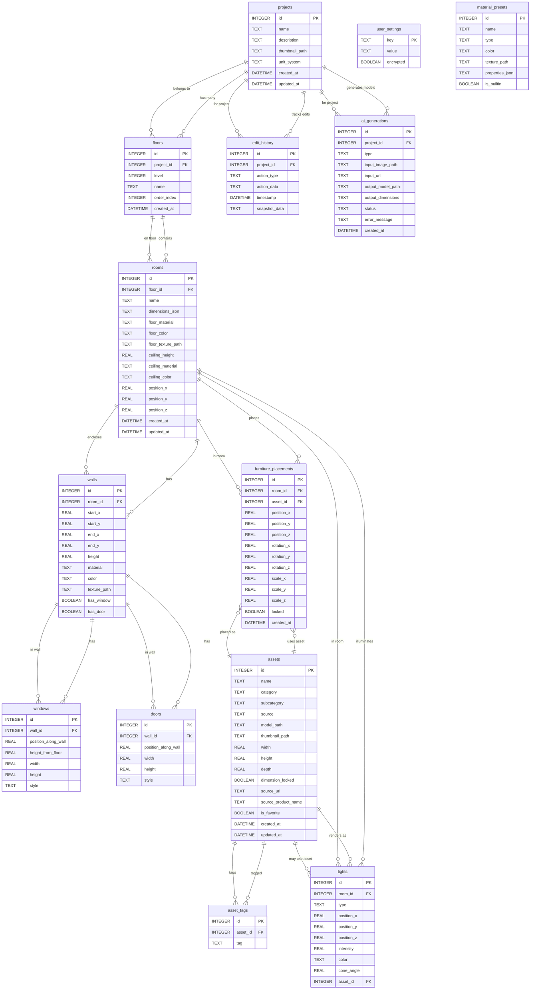

# Database Schema & Data Model Reference

This document provides a complete reference for the Home Designer SQLite database schema, including all tables, relationships, constraints, and data patterns.

**Database Type:** SQLite via `sql.js` (in-memory with disk persistence)
**Database File:** `backend/database.db`

## Table of Contents

- [Entity-Relationship Diagram](#entity-relationship-diagram)
- [Table Definitions](#table-definitions)
  - [projects](#projects)
  - [floors](#floors)
  - [rooms](#rooms)
  - [walls](#walls)
  - [windows](#windows)
  - [doors](#doors)
  - [assets](#assets)
  - [asset_tags](#asset_tags)
  - [furniture_placements](#furniture_placements)
  - [lights](#lights)
  - [edit_history](#edit_history)
  - [ai_generations](#ai_generations)
  - [user_settings](#user_settings)
  - [material_presets](#material_presets)
- [JSON Column Schemas](#json-column-schemas)
- [Relationships & Cascading](#relationships--cascading)
- [Indexing Strategy](#indexing-strategy)
- [Common Query Patterns](#common-query-patterns)
- [Data Lifecycle](#data-lifecycle)
- [Migration Notes](#migration-notes)

---

## Entity-Relationship Diagram



---

## Table Definitions

### projects

**Purpose:** Stores project metadata and settings.

| Column | Type | Constraints | Default | Description |
|--------|------|-------------|---------|-------------|
| `id` | INTEGER | PRIMARY KEY AUTOINCREMENT | - | Unique project identifier |
| `name` | TEXT | NOT NULL | - | Project name (max 255 chars) |
| `description` | TEXT | - | NULL | Optional project description |
| `thumbnail_path` | TEXT | - | NULL | Path to project thumbnail image |
| `unit_system` | TEXT | CHECK IN ('metric', 'imperial') | 'metric' | Measurement unit system |
| `created_at` | DATETIME | - | CURRENT_TIMESTAMP | Project creation timestamp |
| `updated_at` | DATETIME | - | CURRENT_TIMESTAMP | Last modification timestamp |

**Foreign Keys:** None
**Indexes:** None (primary key auto-indexed)

**Relationships:**
- Has many `floors`
- Has many `edit_history` records
- Has many `ai_generations` records

---

### floors

**Purpose:** Represents floor levels within a project.

| Column | Type | Constraints | Default | Description |
|--------|------|-------------|---------|-------------|
| `id` | INTEGER | PRIMARY KEY AUTOINCREMENT | - | Unique floor identifier |
| `project_id` | INTEGER | NOT NULL, FOREIGN KEY → projects(id) | - | Parent project |
| `level` | INTEGER | NOT NULL | - | Floor level (0 = ground, 1 = first, -1 = basement) |
| `name` | TEXT | NOT NULL | - | Floor name (e.g., "Ground Floor") |
| `order_index` | INTEGER | NOT NULL | - | Display order in UI |
| `created_at` | DATETIME | - | CURRENT_TIMESTAMP | Creation timestamp |

**Foreign Keys:**
- `project_id` → `projects(id)` ON DELETE CASCADE

**Indexes:**
- `idx_floors_project_id` on `project_id`

**Relationships:**
- Belongs to one `project`
- Has many `rooms`

---

### rooms

**Purpose:** Stores room geometry, position, and material properties.

| Column | Type | Constraints | Default | Description |
|--------|------|-------------|---------|-------------|
| `id` | INTEGER | PRIMARY KEY AUTOINCREMENT | - | Unique room identifier |
| `floor_id` | INTEGER | NOT NULL, FOREIGN KEY → floors(id) | - | Parent floor |
| `name` | TEXT | - | NULL | Room name (e.g., "Living Room") |
| `dimensions_json` | TEXT | NOT NULL | - | JSON: room dimensions and shape |
| `floor_material` | TEXT | - | NULL | Floor material identifier |
| `floor_color` | TEXT | - | NULL | Floor color (hex code or name) |
| `floor_texture_path` | TEXT | - | NULL | Path to floor texture image |
| `ceiling_height` | REAL | - | 2.8 | Ceiling height in meters |
| `ceiling_material` | TEXT | - | NULL | Ceiling material identifier |
| `ceiling_color` | TEXT | - | NULL | Ceiling color |
| `position_x` | REAL | - | 0 | Room center X position |
| `position_y` | REAL | - | 0 | Room center Y position |
| `position_z` | REAL | - | 0 | Room center Z position |
| `created_at` | DATETIME | - | CURRENT_TIMESTAMP | Creation timestamp |
| `updated_at` | DATETIME | - | CURRENT_TIMESTAMP | Last modification timestamp |

**Foreign Keys:**
- `floor_id` → `floors(id)` ON DELETE CASCADE

**Indexes:**
- `idx_rooms_floor_id` on `floor_id`

**Relationships:**
- Belongs to one `floor`
- Has many `walls`
- Has many `furniture_placements`
- Has many `lights`

**Notes:**
- `dimensions_json` stores room geometry (see [JSON Column Schemas](#json-column-schemas))
- Position coordinates are in the 3D scene's coordinate system

---

### walls

**Purpose:** Defines wall segments that enclose rooms.

| Column | Type | Constraints | Default | Description |
|--------|------|-------------|---------|-------------|
| `id` | INTEGER | PRIMARY KEY AUTOINCREMENT | - | Unique wall identifier |
| `room_id` | INTEGER | NOT NULL, FOREIGN KEY → rooms(id) | - | Parent room |
| `start_x` | REAL | NOT NULL | - | Wall start point X coordinate |
| `start_y` | REAL | NOT NULL | - | Wall start point Y coordinate |
| `end_x` | REAL | NOT NULL | - | Wall end point X coordinate |
| `end_y` | REAL | NOT NULL | - | Wall end point Y coordinate |
| `height` | REAL | NOT NULL | - | Wall height in meters |
| `material` | TEXT | - | NULL | Wall material identifier |
| `color` | TEXT | - | NULL | Wall color (hex code or name) |
| `texture_path` | TEXT | - | NULL | Path to wall texture image |
| `has_window` | BOOLEAN | - | 0 | Whether wall has a window |
| `has_door` | BOOLEAN | - | 0 | Whether wall has a door |

**Foreign Keys:**
- `room_id` → `rooms(id)` ON DELETE CASCADE

**Indexes:**
- `idx_walls_room_id` on `room_id`

**Relationships:**
- Belongs to one `room`
- Has many `windows`
- Has many `doors`

**Notes:**
- Wall coordinates are relative to room center
- A rectangular room typically has 4 walls

---

### windows

**Purpose:** Defines windows placed on walls.

| Column | Type | Constraints | Default | Description |
|--------|------|-------------|---------|-------------|
| `id` | INTEGER | PRIMARY KEY AUTOINCREMENT | - | Unique window identifier |
| `wall_id` | INTEGER | NOT NULL, FOREIGN KEY → walls(id) | - | Parent wall |
| `position_along_wall` | REAL | NOT NULL | - | Position along wall length (0-1) |
| `height_from_floor` | REAL | NOT NULL | - | Height from floor in meters |
| `width` | REAL | NOT NULL | - | Window width in meters |
| `height` | REAL | NOT NULL | - | Window height in meters |
| `style` | TEXT | - | NULL | Window style identifier |

**Foreign Keys:**
- `wall_id` → `walls(id)` ON DELETE CASCADE

**Indexes:**
- `idx_windows_wall_id` on `wall_id`

**Relationships:**
- Belongs to one `wall`

---

### doors

**Purpose:** Defines doors placed on walls.

| Column | Type | Constraints | Default | Description |
|--------|------|-------------|---------|-------------|
| `id` | INTEGER | PRIMARY KEY AUTOINCREMENT | - | Unique door identifier |
| `wall_id` | INTEGER | NOT NULL, FOREIGN KEY → walls(id) | - | Parent wall |
| `position_along_wall` | REAL | NOT NULL | - | Position along wall length (0-1) |
| `width` | REAL | NOT NULL | - | Door width in meters |
| `height` | REAL | NOT NULL | - | Door height in meters |
| `style` | TEXT | - | NULL | Door style identifier |

**Foreign Keys:**
- `wall_id` → `walls(id)` ON DELETE CASCADE

**Indexes:**
- `idx_doors_wall_id` on `wall_id`

**Relationships:**
- Belongs to one `wall`

---

### assets

**Purpose:** Library of 3D models (furniture, decor, lighting, etc.).

| Column | Type | Constraints | Default | Description |
|--------|------|-------------|---------|-------------|
| `id` | INTEGER | PRIMARY KEY AUTOINCREMENT | - | Unique asset identifier |
| `name` | TEXT | NOT NULL | - | Asset name |
| `category` | TEXT | NOT NULL | - | Asset category (furniture, lighting, decor, etc.) |
| `subcategory` | TEXT | - | NULL | Asset subcategory |
| `source` | TEXT | NOT NULL, CHECK IN ('builtin', 'generated', 'imported', 'url_import') | - | Asset source type |
| `model_path` | TEXT | NOT NULL | - | Path to 3D model file (glTF/GLB) |
| `thumbnail_path` | TEXT | - | NULL | Path to thumbnail image |
| `width` | REAL | - | NULL | Asset width in meters |
| `height` | REAL | - | NULL | Asset height in meters |
| `depth` | REAL | - | NULL | Asset depth in meters |
| `dimension_locked` | BOOLEAN | - | 0 | Whether dimensions are locked |
| `source_url` | TEXT | - | NULL | Original URL (for url_import) |
| `source_product_name` | TEXT | - | NULL | Original product name |
| `is_favorite` | BOOLEAN | - | 0 | User favorited status |
| `created_at` | DATETIME | - | CURRENT_TIMESTAMP | Creation timestamp |
| `updated_at` | DATETIME | - | CURRENT_TIMESTAMP | Last modification timestamp |

**Foreign Keys:** None

**Indexes:**
- `idx_assets_category` on `category`
- `idx_assets_is_favorite` on `is_favorite`

**Relationships:**
- Has many `asset_tags`
- Has many `furniture_placements`
- Has many `lights` (optional association)

**Notes:**
- `source` types:
  - `builtin`: Pre-installed assets
  - `generated`: AI-generated via TRELLIS
  - `imported`: User-imported files
  - `url_import`: Downloaded from product URL

---

### asset_tags

**Purpose:** Tagging system for asset search and filtering.

| Column | Type | Constraints | Default | Description |
|--------|------|-------------|---------|-------------|
| `id` | INTEGER | PRIMARY KEY AUTOINCREMENT | - | Unique tag identifier |
| `asset_id` | INTEGER | NOT NULL, FOREIGN KEY → assets(id) | - | Tagged asset |
| `tag` | TEXT | NOT NULL | - | Tag value (e.g., "modern", "wood") |

**Foreign Keys:**
- `asset_id` → `assets(id)` ON DELETE CASCADE

**Indexes:**
- `idx_asset_tags_asset_id` on `asset_id`

**Relationships:**
- Belongs to one `asset`

---

### furniture_placements

**Purpose:** Instances of assets placed in rooms with transforms.

| Column | Type | Constraints | Default | Description |
|--------|------|-------------|---------|-------------|
| `id` | INTEGER | PRIMARY KEY AUTOINCREMENT | - | Unique placement identifier |
| `room_id` | INTEGER | NOT NULL, FOREIGN KEY → rooms(id) | - | Room containing furniture |
| `asset_id` | INTEGER | NOT NULL, FOREIGN KEY → assets(id) | - | Asset being placed |
| `position_x` | REAL | NOT NULL | - | X position in room |
| `position_y` | REAL | NOT NULL | - | Y position (height) |
| `position_z` | REAL | NOT NULL | - | Z position in room |
| `rotation_x` | REAL | - | 0 | X-axis rotation (radians) |
| `rotation_y` | REAL | - | 0 | Y-axis rotation (radians) |
| `rotation_z` | REAL | - | 0 | Z-axis rotation (radians) |
| `scale_x` | REAL | - | 1.0 | X-axis scale factor |
| `scale_y` | REAL | - | 1.0 | Y-axis scale factor |
| `scale_z` | REAL | - | 1.0 | Z-axis scale factor |
| `locked` | BOOLEAN | - | 0 | Whether placement is locked (non-editable) |
| `created_at` | DATETIME | - | CURRENT_TIMESTAMP | Creation timestamp |

**Foreign Keys:**
- `room_id` → `rooms(id)` ON DELETE CASCADE
- `asset_id` → `assets(id)` (NO CASCADE - preserves history)

**Indexes:**
- `idx_furniture_placements_room_id` on `room_id`
- `idx_furniture_placements_asset_id` on `asset_id`

**Relationships:**
- Belongs to one `room`
- Belongs to one `asset`

**Notes:**
- Deleting the asset does NOT delete placements (preserves project history)
- Transform follows Three.js conventions (position, rotation, scale)

---

### lights

**Purpose:** Lighting fixtures and sources in rooms.

| Column | Type | Constraints | Default | Description |
|--------|------|-------------|---------|-------------|
| `id` | INTEGER | PRIMARY KEY AUTOINCREMENT | - | Unique light identifier |
| `room_id` | INTEGER | NOT NULL, FOREIGN KEY → rooms(id) | - | Room containing light |
| `type` | TEXT | NOT NULL, CHECK IN ('floor_lamp', 'ceiling', 'wall_sconce', 'table_lamp', 'pendant') | - | Light type |
| `position_x` | REAL | NOT NULL | - | X position in room |
| `position_y` | REAL | NOT NULL | - | Y position (height) |
| `position_z` | REAL | NOT NULL | - | Z position in room |
| `intensity` | REAL | - | 1.0 | Light intensity (0.0-1.0) |
| `color` | TEXT | - | '#ffffff' | Light color (hex code) |
| `cone_angle` | REAL | - | NULL | Cone angle for spotlights (degrees) |
| `asset_id` | INTEGER | FOREIGN KEY → assets(id) | NULL | Optional asset for visual representation |

**Foreign Keys:**
- `room_id` → `rooms(id)` ON DELETE CASCADE
- `asset_id` → `assets(id)` (optional)

**Indexes:**
- `idx_lights_room_id` on `room_id`

**Relationships:**
- Belongs to one `room`
- May belong to one `asset` (for rendering the fixture)

---

### edit_history

**Purpose:** Stores undo/redo action history for projects.

| Column | Type | Constraints | Default | Description |
|--------|------|-------------|---------|-------------|
| `id` | INTEGER | PRIMARY KEY AUTOINCREMENT | - | Unique history entry identifier |
| `project_id` | INTEGER | NOT NULL, FOREIGN KEY → projects(id) | - | Project this action belongs to |
| `action_type` | TEXT | NOT NULL | - | Action type (e.g., 'furniture_add', 'room_delete') |
| `action_data` | TEXT | - | NULL | JSON: action-specific data |
| `timestamp` | DATETIME | - | CURRENT_TIMESTAMP | When action occurred |
| `snapshot_data` | TEXT | - | NULL | JSON: state snapshot for undo |

**Foreign Keys:**
- `project_id` → `projects(id)` ON DELETE CASCADE

**Indexes:**
- `idx_edit_history_project_id` on `project_id`

**Relationships:**
- Belongs to one `project`

**Notes:**
- Used by Zustand store for undo/redo functionality
- `action_data` and `snapshot_data` store JSON (see [JSON Column Schemas](#json-column-schemas))

---

### ai_generations

**Purpose:** Tracks AI-powered 3D model generation jobs.

| Column | Type | Constraints | Default | Description |
|--------|------|-------------|---------|-------------|
| `id` | INTEGER | PRIMARY KEY AUTOINCREMENT | - | Unique generation identifier |
| `project_id` | INTEGER | FOREIGN KEY → projects(id) | NULL | Associated project (optional) |
| `type` | TEXT | NOT NULL, CHECK IN ('photo_to_room', 'photo_to_furniture', 'url_import') | - | Generation type |
| `input_image_path` | TEXT | - | NULL | Path to uploaded input image |
| `input_url` | TEXT | - | NULL | Input URL (for url_import) |
| `output_model_path` | TEXT | - | NULL | Path to generated 3D model |
| `output_dimensions` | TEXT | - | NULL | JSON: model dimensions |
| `status` | TEXT | NOT NULL, CHECK IN ('pending', 'processing', 'completed', 'failed') | 'pending' | Generation status |
| `error_message` | TEXT | - | NULL | Error message if failed |
| `created_at` | DATETIME | - | CURRENT_TIMESTAMP | Creation timestamp |

**Foreign Keys:**
- `project_id` → `projects(id)` ON DELETE SET NULL

**Indexes:**
- `idx_ai_generations_project_id` on `project_id`

**Relationships:**
- Belongs to one `project` (optional)

**Notes:**
- `status` lifecycle: `pending` → `processing` → `completed` / `failed`
- `output_dimensions` stores JSON (see [JSON Column Schemas](#json-column-schemas))

---

### user_settings

**Purpose:** Application-wide user settings and preferences.

| Column | Type | Constraints | Default | Description |
|--------|------|-------------|---------|-------------|
| `key` | TEXT | PRIMARY KEY | - | Setting key (unique identifier) |
| `value` | TEXT | NOT NULL | - | Setting value (may be encrypted) |
| `encrypted` | BOOLEAN | - | 0 | Whether value is encrypted |

**Foreign Keys:** None
**Indexes:** None (primary key auto-indexed)

**Relationships:** None

**Default Settings:**
- `unit_system`: "metric"
- `render_quality`: "high"
- `auto_save_interval`: "60000"
- `performance_mode`: "0"

**Encrypted Settings:**
- `trellis_api_key`
- `openai_api_key`
- `anthropic_api_key`

**Notes:**
- Encrypted values use AES-256-CBC
- Encryption key from `process.env.ENCRYPTION_KEY`

---

### material_presets

**Purpose:** Reusable material configurations for walls, floors, and ceilings.

| Column | Type | Constraints | Default | Description |
|--------|------|-------------|---------|-------------|
| `id` | INTEGER | PRIMARY KEY AUTOINCREMENT | - | Unique preset identifier |
| `name` | TEXT | NOT NULL | - | Preset name |
| `type` | TEXT | NOT NULL, CHECK IN ('wall', 'floor', 'ceiling') | - | Material type |
| `color` | TEXT | - | NULL | Material color (hex code) |
| `texture_path` | TEXT | - | NULL | Path to texture image |
| `properties_json` | TEXT | - | NULL | JSON: additional material properties |
| `is_builtin` | BOOLEAN | - | 1 | Whether preset is built-in |

**Foreign Keys:** None
**Indexes:** None

**Relationships:** None

**Default Presets:**
- Walls: White Paint (#FFFFFF), Light Gray (#E5E7EB), Warm Beige (#F5F5DC)
- Floors: Light Hardwood (#DEB887), Dark Hardwood (#8B4513), White Tile (#F8F8F8), Gray Carpet (#9CA3AF)
- Ceilings: White Ceiling (#FFFFFF), Off-White Ceiling (#FAFAFA)

---

## JSON Column Schemas

### rooms.dimensions_json

**Purpose:** Stores room geometry and shape.

**Schema:**
```typescript
{
  width: number; // Room width in meters
  depth: number; // Room depth in meters
  vertices?: Array<{ // Optional: for non-rectangular rooms
    x: number;
    y: number;
  }>;
}
```

**Example:**
```json
{
  "width": 5.2,
  "depth": 4.8
}
```

**Example (non-rectangular):**
```json
{
  "width": 6.0,
  "depth": 5.0,
  "vertices": [
    { "x": 0, "y": 0 },
    { "x": 6, "y": 0 },
    { "x": 6, "y": 4 },
    { "x": 4, "y": 5 },
    { "x": 0, "y": 5 }
  ]
}
```

---

### edit_history.action_data

**Purpose:** Stores action-specific data for undo/redo.

**Schema (varies by action_type):**

**furniture_add / furniture_remove:**
```typescript
{
  furniture: {
    id: number;
    room_id: number;
    asset_id: number;
    position_x: number;
    position_y: number;
    position_z: number;
    rotation_x: number;
    rotation_y: number;
    rotation_z: number;
    scale_x: number;
    scale_y: number;
    scale_z: number;
  };
}
```

**furniture_move:**
```typescript
{
  furnitureId: number;
  previousPosition: { x: number; y: number; z: number };
  newPosition: { x: number; y: number; z: number };
}
```

**room_add / room_remove:**
```typescript
{
  room: {
    id: number;
    floor_id: number;
    dimensions_json: { width: number; depth: number };
    // ... other room fields
  };
}
```

---

### edit_history.snapshot_data

**Purpose:** Complete state snapshot for reverting actions.

**Schema:**
```typescript
{
  rooms?: Array<Room>;
  furniturePlacements?: Array<FurniturePlacement>;
  walls?: Array<Wall>;
  // Full state before action was performed
}
```

---

### material_presets.properties_json

**Purpose:** Additional material properties (PBR, reflectivity, etc.).

**Schema:**
```typescript
{
  roughness?: number; // 0.0-1.0
  metalness?: number; // 0.0-1.0
  normalMap?: string; // Path to normal map
  bumpMap?: string; // Path to bump map
  emissive?: string; // Emissive color (hex)
  emissiveIntensity?: number; // 0.0-1.0
}
```

**Example:**
```json
{
  "roughness": 0.8,
  "metalness": 0.0,
  "normalMap": "textures/wood-normal.jpg"
}
```

---

### ai_generations.output_dimensions

**Purpose:** Stores dimensions of AI-generated 3D model.

**Schema:**
```typescript
{
  width: number; // Model width in meters
  height: number; // Model height in meters
  depth: number; // Model depth in meters
}
```

**Example:**
```json
{
  "width": 0.6,
  "height": 1.2,
  "depth": 0.5
}
```

---

## Relationships & Cascading

### Foreign Key Constraints

**Enabled:** `PRAGMA foreign_keys = ON` is set on every database connection.

### Cascading Delete Behavior

**Full CASCADE (delete propagates):**

```
projects (DELETE)
  ├─> floors (CASCADE DELETE)
  │    └─> rooms (CASCADE DELETE)
  │         ├─> walls (CASCADE DELETE)
  │         │    ├─> windows (CASCADE DELETE)
  │         │    └─> doors (CASCADE DELETE)
  │         ├─> furniture_placements (CASCADE DELETE)
  │         └─> lights (CASCADE DELETE)
  ├─> edit_history (CASCADE DELETE)
  └─> ai_generations (SET NULL project_id)
```

**Partial CASCADE:**

```
assets (DELETE)
  └─> asset_tags (CASCADE DELETE)
  └─> furniture_placements (NO CASCADE - preserves project history)
  └─> lights.asset_id (NO CASCADE - optional reference)
```

### Cascade Implementation

**SQLite CASCADE:** Declared in foreign key constraints (`ON DELETE CASCADE`).

**Manual CASCADE:** Some routes implement manual cascade deletion for reliability:
- `DELETE /api/projects/:id` - Manually deletes floors, rooms, walls, furniture, lights
- `DELETE /api/floors/:id` - Manually deletes rooms and their contents
- `DELETE /api/rooms/:id` - Manually deletes walls, furniture, lights

**Reason for Manual CASCADE:**
- `sql.js` foreign key cascade reliability issues
- Ensures all related data is cleaned up
- Provides better error handling and logging

### Orphan Prevention

**Assets:**
- Deleting an asset does NOT delete furniture placements
- Prevents accidental loss of project data
- Frontend should prevent deleting assets in use

**Project References:**
- AI generations use `ON DELETE SET NULL` for `project_id`
- Preserves generation history even if project deleted

---

## Indexing Strategy

### Indexes Created

All indexes are created in `backend/src/db/init.js`:

```sql
CREATE INDEX idx_floors_project_id ON floors(project_id);
CREATE INDEX idx_rooms_floor_id ON rooms(floor_id);
CREATE INDEX idx_walls_room_id ON walls(room_id);
CREATE INDEX idx_furniture_placements_room_id ON furniture_placements(room_id);
CREATE INDEX idx_furniture_placements_asset_id ON furniture_placements(asset_id);
CREATE INDEX idx_lights_room_id ON lights(room_id);
CREATE INDEX idx_windows_wall_id ON windows(wall_id);
CREATE INDEX idx_doors_wall_id ON doors(wall_id);
CREATE INDEX idx_edit_history_project_id ON edit_history(project_id);
CREATE INDEX idx_ai_generations_project_id ON ai_generations(project_id);
CREATE INDEX idx_asset_tags_asset_id ON asset_tags(asset_id);
CREATE INDEX idx_assets_category ON assets(category);
CREATE INDEX idx_assets_is_favorite ON assets(is_favorite);
```

### Indexing Rationale

**Foreign Key Indexes:**
- Speed up JOIN queries
- Enable efficient cascade deletes
- Improve listing queries (e.g., GET /api/floors/:floorId/rooms)

**Filter Indexes:**
- `assets.category` - Asset filtering by category
- `assets.is_favorite` - Quickly fetch favorited assets

**No Index Needed:**
- Primary keys (auto-indexed by SQLite)
- `user_settings.key` (primary key, already indexed)

---

## Common Query Patterns

### Listing with Joins

**Pattern:** Fetch child records with parent data.

**Example:** Get furniture with asset details
```sql
SELECT fp.*, a.name as asset_name, a.category, a.model_path, a.width, a.height, a.depth
FROM furniture_placements fp
JOIN assets a ON fp.asset_id = a.id
WHERE fp.room_id = ?
ORDER BY fp.created_at ASC
```

**Used in:** `GET /api/rooms/:id/furniture`

---

### Hierarchical Loading

**Pattern:** Load project → floors → rooms → furniture.

**Example:** Load project with all floors
```sql
-- Step 1: Get project
SELECT * FROM projects WHERE id = ?

-- Step 2: Get floors for project
SELECT * FROM floors WHERE project_id = ? ORDER BY order_index

-- Step 3: For each floor, get rooms
SELECT * FROM rooms WHERE floor_id = ?

-- Step 4: For each room, get furniture
SELECT * FROM furniture_placements WHERE room_id = ?
```

**Used in:** Frontend project loading flow

---

### Search with Filters

**Pattern:** Build dynamic WHERE clauses based on filters.

**Example:** Asset search with category and favorites
```sql
SELECT * FROM assets
WHERE 1=1
  AND category = ? -- If category filter provided
  AND name LIKE ? -- If search query provided
  AND is_favorite = 1 -- If favorites filter enabled
ORDER BY created_at DESC
```

**Used in:** `GET /api/assets?category=...&search=...&favorite=true`

---

### Aggregations

**Pattern:** Count related records.

**Example:** Count rooms per floor
```sql
SELECT f.id, f.name, COUNT(r.id) as room_count
FROM floors f
LEFT JOIN rooms r ON r.floor_id = f.id
WHERE f.project_id = ?
GROUP BY f.id
```

**Used in:** Properties panel room counts

---

### Cascading Deletes (Manual)

**Pattern:** Recursively delete related records.

**Example:** Delete project with all data
```sql
-- Get floor IDs
SELECT id FROM floors WHERE project_id = ?

-- Get room IDs for those floors
SELECT id FROM rooms WHERE floor_id IN (...)

-- Get wall IDs for those rooms
SELECT id FROM walls WHERE room_id IN (...)

-- Delete windows and doors
DELETE FROM windows WHERE wall_id IN (...)
DELETE FROM doors WHERE wall_id IN (...)

-- Delete furniture, lights, walls
DELETE FROM furniture_placements WHERE room_id IN (...)
DELETE FROM lights WHERE room_id IN (...)
DELETE FROM walls WHERE room_id IN (...)

-- Delete rooms, floors, project
DELETE FROM rooms WHERE id IN (...)
DELETE FROM floors WHERE id IN (...)
DELETE FROM projects WHERE id = ?
```

**Used in:** `DELETE /api/projects/:id`

---

## Data Lifecycle

### Record Creation

**Flow:**
1. API endpoint receives request
2. Validate required fields
3. Check foreign key existence (parent record)
4. `INSERT` into table
5. `SELECT last_insert_rowid()` to get new ID
6. `SELECT * FROM table WHERE id = ?` to return full record
7. Call `saveDatabase()` to persist to disk
8. Return record to client

**Example:** Creating a room
```javascript
// 1. Insert room
db.run(`INSERT INTO rooms (...) VALUES (?, ?, ...)`, [floorId, ...]);

// 2. Get inserted room
const result = db.exec('SELECT * FROM rooms ORDER BY id DESC LIMIT 1');

// 3. Create walls for the room
db.run(`INSERT INTO walls (...) VALUES (?, ?, ...)`, [roomId, ...]);

// 4. Save to disk
saveDatabase();

// 5. Return room
res.status(201).json({ room });
```

---

### Record Updates

**Flow:**
1. API endpoint receives request
2. Check record exists (404 if not found)
3. `UPDATE` with `COALESCE(?, existing_value)` pattern for partial updates
4. Update `updated_at` timestamp (if applicable)
5. Call `saveDatabase()` to persist
6. `SELECT` updated record
7. Return updated record to client

**Example:** Updating a room
```javascript
db.run(`
  UPDATE rooms
  SET floor_color = COALESCE(?, floor_color),
      ceiling_height = COALESCE(?, ceiling_height),
      updated_at = CURRENT_TIMESTAMP
  WHERE id = ?
`, [floor_color || null, ceiling_height || null, roomId]);

saveDatabase();

const result = db.exec('SELECT * FROM rooms WHERE id = ?', [roomId]);
res.json({ room: result[0] });
```

---

### Hard Deletes

**Flow:**
1. API endpoint receives request
2. Check record exists (404 if not found)
3. For critical deletes, manually cascade delete related records
4. `DELETE FROM table WHERE id = ?`
5. Call `saveDatabase()` to persist
6. Return success message

**No Soft Deletes:**
- Home Designer uses **hard deletes** only
- No `deleted_at` columns or soft delete flags
- Deleted data is permanently removed

**Undo Support:**
- Undo/redo system stores snapshots in `edit_history`
- Deleted records can be restored via undo

---

### Auto-Save Data Flow

**Mechanism:**
1. Every `INSERT`, `UPDATE`, `DELETE` triggers `saveDatabase()`
2. `saveDatabase()` exports in-memory database to Buffer
3. Buffer written to `backend/database.db` file
4. File system write is synchronous (blocks until complete)

**Advantages:**
- Immediate persistence
- No data loss on crashes
- Simple implementation

**Trade-offs:**
- Frequent disk writes
- No batching (each mutation saves independently)
- OS-level caching mitigates performance impact

---

### Undo/Redo Snapshot Storage

**Mechanism:**
1. User performs action (e.g., add furniture)
2. Frontend creates action object with `type`, `description`, `data`
3. Action added to Zustand store history
4. History persisted to `edit_history` table (optional, not currently implemented)

**Undo Flow:**
1. Get action at current history index
2. Reverse the action (e.g., delete furniture)
3. Make API call to undo
4. Update local state
5. Decrement history index

**Redo Flow:**
1. Increment history index
2. Get action at new index
3. Re-apply the action
4. Make API call
5. Update local state

---

## Migration Notes

### SQLite-Specific Patterns

**sql.js (WebAssembly SQLite):**
- In-memory database loaded from file on startup
- Manual `saveDatabase()` required to persist changes
- No connection pooling (single connection)

**SQLite Limitations:**
- No `AUTO_INCREMENT` in `ALTER TABLE` (must recreate table)
- No `ON CONFLICT` in older versions (upsert workarounds)
- Foreign key constraints off by default (must enable)

**sql.js Quirks:**
- `last_insert_rowid()` must be called immediately after insert
- `PRAGMA foreign_keys = ON` must be set on every connection
- CASCADE DELETE reliability requires manual implementation

---

### Migration to PostgreSQL

**Why Migrate?**
- Better concurrency (connection pooling)
- Stronger ACID guarantees
- Built-in replication and backup
- Full-text search support
- JSON column types (JSONB)
- No manual save required (auto-persist)

**Schema Changes Required:**

**1. Data Types:**
```sql
-- SQLite
TEXT (stores anything)
INTEGER
REAL
BOOLEAN (stored as 0/1)

-- PostgreSQL
VARCHAR(255) or TEXT
INTEGER or BIGINT
REAL or DOUBLE PRECISION
BOOLEAN (native type)
```

**2. Auto-Increment:**
```sql
-- SQLite
id INTEGER PRIMARY KEY AUTOINCREMENT

-- PostgreSQL
id SERIAL PRIMARY KEY
-- or
id BIGSERIAL PRIMARY KEY
```

**3. JSON Columns:**
```sql
-- SQLite
dimensions_json TEXT

-- PostgreSQL
dimensions_json JSONB
```

**4. Timestamps:**
```sql
-- SQLite
created_at DATETIME DEFAULT CURRENT_TIMESTAMP

-- PostgreSQL
created_at TIMESTAMP WITH TIME ZONE DEFAULT NOW()
```

**5. Boolean Defaults:**
```sql
-- SQLite
is_favorite BOOLEAN DEFAULT 0

-- PostgreSQL
is_favorite BOOLEAN DEFAULT FALSE
```

---

### Abstraction Layer

**Current Approach:**
- Direct `db.exec()` and `db.run()` calls
- No ORM or query builder

**Recommended Abstraction:**
- Use Knex.js query builder
- Abstract database-specific SQL
- Enable easy migration to PostgreSQL

**Example Migration:**

**Before (SQLite direct):**
```javascript
db.run('INSERT INTO rooms (...) VALUES (?, ?, ?)', [a, b, c]);
const result = db.exec('SELECT * FROM rooms ORDER BY id DESC LIMIT 1');
```

**After (Knex.js):**
```javascript
const [room] = await knex('rooms').insert({...}).returning('*');
```

**Benefits:**
- Database-agnostic queries
- Better type safety with TypeScript
- Connection pooling support
- Transaction support
- Migration management

---

### Migration Checklist

- [ ] Install PostgreSQL driver (`pg`)
- [ ] Install Knex.js or Prisma ORM
- [ ] Convert schema to PostgreSQL DDL
- [ ] Update data types (TEXT → VARCHAR, BOOLEAN → BOOLEAN)
- [ ] Replace `db.exec()` with Knex queries
- [ ] Remove `saveDatabase()` calls (auto-persist)
- [ ] Update `PRAGMA foreign_keys = ON` to PostgreSQL foreign key syntax
- [ ] Test CASCADE deletes thoroughly
- [ ] Add connection pooling configuration
- [ ] Update backup strategy (pg_dump instead of file copy)
- [ ] Add indexes (same as SQLite, syntax compatible)
- [ ] Migrate existing data (export SQLite → import PostgreSQL)

---

## Database Maintenance

### Backup Strategy

**Current Approach:**
- Copy `backend/database.db` file
- Simple file-based backup

**Recommended:**
- Regular automated backups (cron job)
- Backup rotation (keep last 7 days, last 4 weeks, last 12 months)
- Off-site backup storage
- Test restore process regularly

**PostgreSQL Approach:**
```bash
pg_dump home_designer > backup_$(date +%Y%m%d).sql
```

---

### Vacuum and Optimize

**SQLite:**
```sql
PRAGMA optimize;
VACUUM;
ANALYZE;
```

**When to Run:**
- After bulk deletes
- Monthly maintenance
- After large imports

**PostgreSQL:**
```sql
VACUUM ANALYZE;
```

---

## Conclusion

This database schema provides a robust foundation for Home Designer's local-first architecture. The use of SQLite enables zero-configuration setup while maintaining the flexibility to migrate to PostgreSQL for multi-user or cloud deployments.

Key design principles:
- **Normalized data**: Minimal redundancy, clear relationships
- **CASCADE deletes**: Automatic cleanup of related data
- **Indexed foreign keys**: Fast joins and lookups
- **JSON columns**: Flexible schema for complex data
- **Encrypted sensitive data**: API keys protected at rest
- **Migration-ready**: Clear path to PostgreSQL

For API usage examples, see [API_REFERENCE.md](./API_REFERENCE.md).
For system architecture overview, see [ARCHITECTURE.md](./ARCHITECTURE.md).
